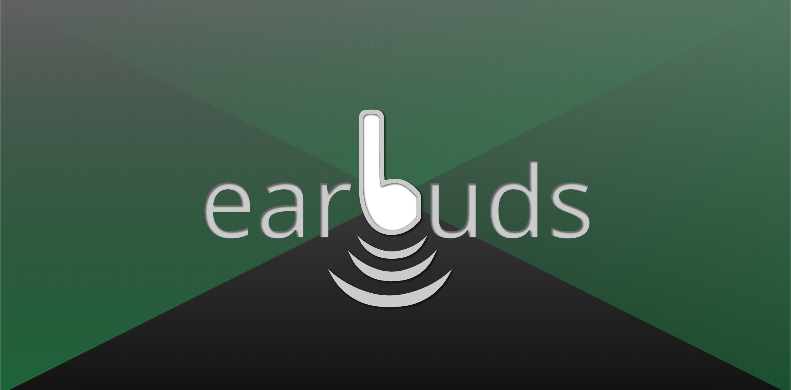
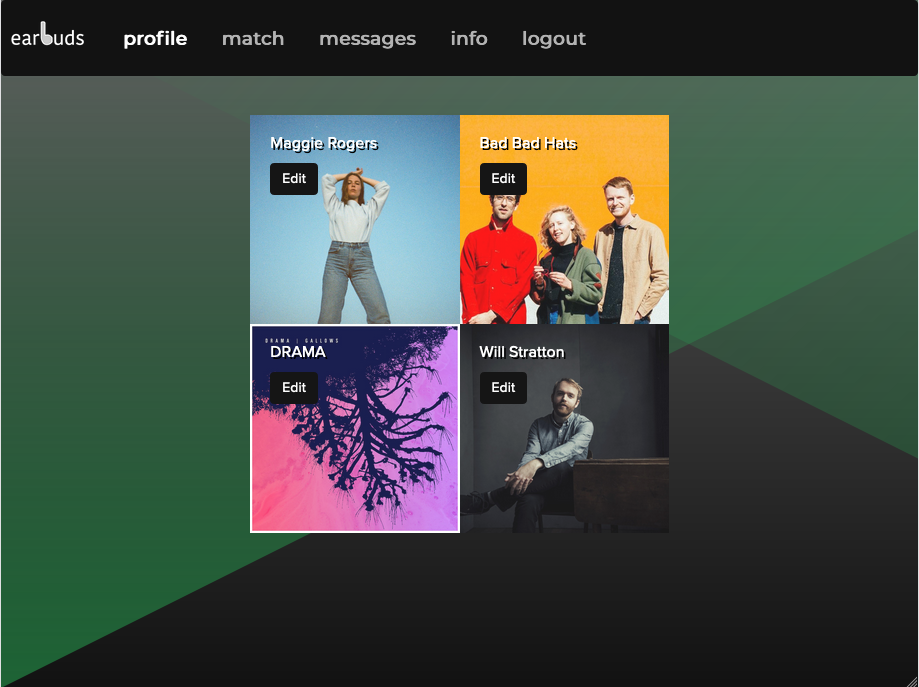
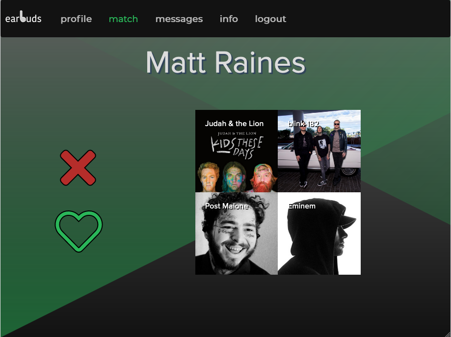
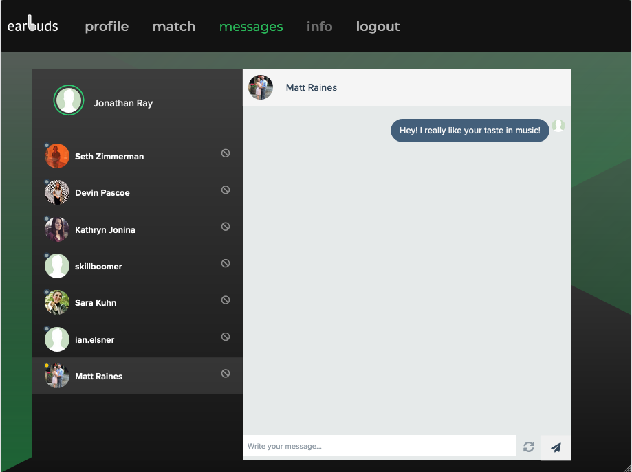
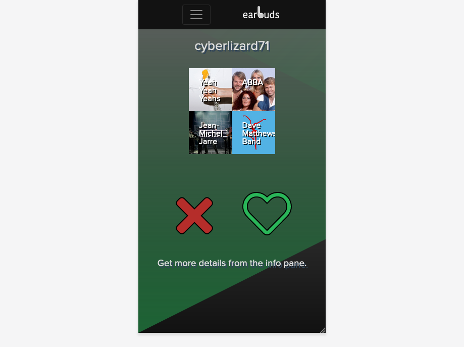

# Ear Buds

## Contents
    -Description
    -Features
    -Technologies
    -Challenges and Solutions
    -MVP
    -Stretch Goals
    -Authors
    -Screenshots

## Decription
“EarBuds” is where music and online profile matching collide. This full-stack application allows user to log in to your proile, edit your top artists, and connect with other users wher you can chat and share different music!

### Features
* A splash pages is loaded with a timeout that will redirect you to sign in with Spotify.
* If you are already logged in, it will bypass you past the login.
* The profile page auto populates your top artists based on your spotify activity.
* You can change your top artists in the database at ny time based on artists in the spotify library.
* The match page will pull other users top artists and allows you to click the heart if you want to connect, or the X if you want to skip them.
* When you are out of matches, or have no one you are matched with, you will get a modal telling you such and redirecting you back to a path to feel these aspects out.
* The messages page shows you everyone you have connected with and allows you to message back and forth with them (not in real time, as that was out of the scope of the project).
* This also incorporates status icons based on the last time another user logged in.
* Lastly, it allows you to block users and it will remove that conversation on both your page as well as the other users page.

## Technologies
* HTML
* CSS
* Javascript
* Spotify API
* PostgreSQL
* Node.js
* Express
* Passport.js

## Challenges and Solutions
* Showing peoples connections on the messaging page without a conversation already started proved to be difficult early on. This was handled by adding a seed message to a converstation each time a connection was made. We had the user that made the connection automatically send `Hey, I really like your taste in music!`.

    Not only did this allow us to put that conversation in the messaging page, but it also got the converstation rolling for the two users, making this a pretty neat feature.

* Having the application load the cities in the drop down menu based on the state selected was a challenge early on. We handled this by pulling in all of the states and corresponding cities into a JSON file, bypassing an unneccessary extra API call.

    We then manipulated the DOM to listen for when the state selection had changed. At that time we appended under the city element all the corresponding cities for the seleted state. Putting all the cities in a JSON file made it so the cities populating was instantaneous

## MVP
* Create a full-stack friend finder using Spotify music.
* Requirements
    * Users can change their top artists to display
    * Users are able to click like or skip on each potential match.
    * Messaging is allowed between the two users.

## Stretch Goals
* Provide 30 second snippets of music when you click on another users artist.
    * Completed (albeit with edge-case issues)
* Creating pre populated playlists between matched users based on their artists.
    * Incomplete
* Making it that both users have to agree to match before they are connected.
    * Incomplete
* Having status icons next to conversations to show when they were last online.
    * Completed

## Authors
* Matt Raines
    * Primary Contributions:
        * Concept, SQL Queries, Matching Integration, Form Submission, Routing
    
    [GitHub Profile](https://github.com/mraines4)

* Jonathan Ray
    * Primary Contributions:
        * Concept, Spotify API Integration, Messaging Integration, Form Submission, Routing
    
    [GitHub Profile](https://github.com/ray-jonathan)

## Screenshots
* Desktop

* Mobile

